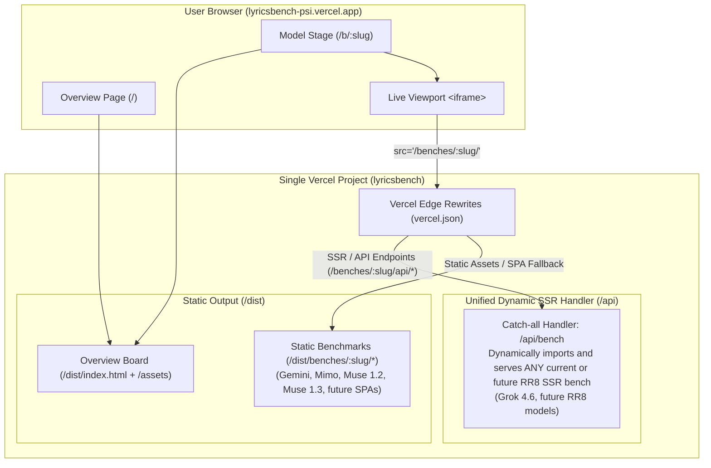

# Architecture Proposal: Unified Single-Project Vercel Deployment (Future-Proof & Scalable)

**Goal:** Keep all benchmark implementations completely untouched in their current format, while enabling the entire platform (Overview + all current and future model booths) to deploy as a single Vercel project at [https://lyricsbench-psi.vercel.app](https://lyricsbench-psi.vercel.app) with the existing UI and live iframe experience.

> [!IMPORTANT]
> **Extensibility Guarantee:** This architecture is completely **data-driven and dynamic**. When new benchmark folders are added in the future (whether Vite SPAs, React Router 8 SSR frameworks, or other setups), **no build scripts, Vercel routes, or serverless functions need to be manually edited**. The orchestrator detects and handles them automatically from [`overview/src/benches.ts`](file:///Users/per/Code/bench/lyricsbench/overview/src/benches.ts).

---

## 1. System Overview & Architecture



---

## 2. Core Architectural Pillars for Future Folders

To handle future model folders (especially React Router 8 SSR apps) with zero manual configuration:

### Pillar 1: Dynamic Bench Discovery & Auto-Detection
The build runner in `overview` does **not** hardcode folder names. It reads [`overview/src/benches.ts`](file:///Users/per/Code/bench/lyricsbench/overview/src/benches.ts) dynamically:
- Inspects each benchmark's `package.json` and config files.
- Automatically determines whether the app is:
  1. **Standard Vite SPA** (runs `vite build --base=/benches/<slug>/`)
  2. **React Router 8 SSR Framework** (runs `react-router build`, compiling both client assets and server bundle)
- Automatically injects the client routing shim into `dist/index.html` for any SPA.

### Pillar 2: Catch-All Serverless Function for ALL RR8 Benches
Instead of writing an individual `/api/grok-4.6.ts` file for Grok and having to create a new file every time an RR8 benchmark is added, a **single dynamic handler** handles all RR8 benches:
- Route: `/api/bench?slug=:slug&path=:path*`
- When a request hits `/benches/:slug/*`:
  - If it's a static client asset (JS, CSS, font, image), Vercel serves it directly from the static output.
  - If it's an SSR document request or backend API route (e.g. `/benches/grok-4.6/api/search?q=...` or `/benches/future-model/api/lyrics`), the request reaches `/api/bench`.
  - The handler dynamically loads `../../${slug}/build/server/index.js` using Node dynamic `import()` and executes `@react-router/node` `createRequestHandler`.

### Pillar 3: Wildcard Root Workspace
In root [`pnpm-workspace.yaml`](file:///Users/per/Code/bench/lyricsbench/pnpm-workspace.yaml):
```yaml
packages:
  - "overview"
  - "*-*"
  - "!test"
```
Any future folder matching the naming scheme (e.g. `claude-3.7-sonnet`, `deepseek-v3`, `gpt-5`) is automatically recognized by `pnpm install` across the monorepo with no changes needed.

---

## 3. Implementation Details

### Step 1: Dynamic Build Orchestrator (`overview/build-all.mjs`)

This script handles any number of current and future benchmark folders automatically:

```javascript
// overview/build-all.mjs
import { execSync } from "node:child_process"
import { cpSync, existsSync, mkdirSync, readFileSync, writeFileSync } from "node:fs"
import path from "node:path"
import { fileURLToPath } from "node:url"

const overviewDir = path.dirname(fileURLToPath(import.meta.url))
const rootDir = path.resolve(overviewDir, "..")
const outBenchesDir = path.join(overviewDir, "dist", "benches")

// 1. Compile the Overview Board application
console.log("==> Building overview board...")
execSync("tsc --noEmit && vite build", { cwd: overviewDir, stdio: "inherit" })

// 2. Discover benches from benches.ts
const benchesSrc = readFileSync(path.join(overviewDir, "src/benches.ts"), "utf8")
const benchMatches = [...benchesSrc.matchAll(/slug:\s*"([^"]+)",[\s\S]*?folder:\s*"([^"]+)",[\s\S]*?command:\s*"([^"]+)"/g)]
const benches = benchMatches.map(([, slug, folder, command]) => ({ slug, folder, command }))

console.log(`==> Found ${benches.length} benchmarks in benches.ts`)

for (const { slug, folder, command } of benches) {
  const benchDir = path.join(rootDir, folder)
  const targetDir = path.join(outBenchesDir, slug)
  const basePath = `/benches/${slug}/`

  console.log(`\n==> [${slug}] Building (${command})...`)

  if (!existsSync(benchDir)) {
    console.warn(`[${slug}] Directory ${benchDir} does not exist. Skipping.`)
    continue
  }

  // Ensure dependencies exist
  if (!existsSync(path.join(benchDir, "node_modules"))) {
    execSync("pnpm install --frozen-lockfile", { cwd: benchDir, stdio: "inherit" })
  }

  let clientOutDir = "dist"

  if (command === "react-router") {
    // React Router 8 Framework (SSR + Client)
    execSync("pnpm exec react-router build", { cwd: benchDir, stdio: "inherit" })
    clientOutDir = "build/client"
  } else {
    // Standard Vite SPA - override base path via CLI flag
    execSync(`pnpm exec vite build --base=${basePath}`, { cwd: benchDir, stdio: "inherit" })
  }

  // Copy static client assets into overview/dist/benches/<slug>/
  const sourceClientDir = path.join(benchDir, clientOutDir)
  if (existsSync(sourceClientDir)) {
    mkdirSync(targetDir, { recursive: true })
    cpSync(sourceClientDir, targetDir, { recursive: true })
  }

  // Inject routing shim into built HTML for SPAs (no source files touched)
  const indexPath = path.join(targetDir, "index.html")
  if (existsSync(indexPath)) {
    let html = readFileSync(indexPath, "utf8")
    const shim = `
      <base href="${basePath}">
      <script>
        (function() {
          const base = "${basePath.replace(/\\/$/, "")}";
          const origPush = history.pushState;
          const origReplace = history.replaceState;
          history.pushState = function(state, title, url) {
            if (typeof url === 'string' && url.startsWith('/') && !url.startsWith(base)) {
              url = base + url;
            }
            return origPush.call(this, state, title, url);
          };
          history.replaceState = function(state, title, url) {
            if (typeof url === 'string' && url.startsWith('/') && !url.startsWith(base)) {
              url = base + url;
            }
            return origReplace.call(this, state, title, url);
          };
        })();
      </script>
    `
    html = html.replace("<head>", `<head>${shim}`)
    writeFileSync(indexPath, html, "utf8")
  }
}

console.log("\n==> All benchmarks built successfully into overview/dist/benches!")
```

---

### Step 2: Universal Dynamic Serverless Function for RR8 Benches (`overview/api/bench.ts`)

A single dynamic serverless function that handles SSR requests and API calls for **any current or future React Router 8 benchmark**:

```typescript
// overview/api/bench.ts
import { createRequestHandler } from "@react-router/node"
import { existsSync } from "node:fs"
import path from "node:path"
import { fileURLToPath } from "node:url"

const rootDir = path.resolve(path.dirname(fileURLToPath(import.meta.url)), "../..")

// Cache loaded server builds in memory across lambdas
const handlers = new Map<string, ReturnType<typeof createRequestHandler>>()

export default async function handler(req: Request): Promise<Response> {
  const url = new URL(req.url)
  const slug = url.searchParams.get("slug")

  if (!slug) {
    return new Response(JSON.stringify({ error: "Missing benchmark slug" }), {
      status: 400,
      headers: { "Content-Type": "application/json" },
    })
  }

  let handleRequest = handlers.get(slug)
  if (!handleRequest) {
    const serverBuildPath = path.join(rootDir, slug, "build/server/index.js")
    if (!existsSync(serverBuildPath)) {
      return new Response(JSON.stringify({ error: `SSR build for ${slug} not found` }), {
        status: 404,
        headers: { "Content-Type": "application/json" },
      })
    }

    const build = await import(serverBuildPath)
    handleRequest = createRequestHandler(build, "production")
    handlers.set(slug, handleRequest)
  }

  return handleRequest(req)
}
```

---

### Step 3: Generic Vercel Rewrites (`overview/vercel.json`)

Clean, generic rewrite rules that support any number of future models without changing `vercel.json`:

```json
{
  "$schema": "https://openapi.vercel.sh/vercel.json",
  "framework": "vite",
  "buildCommand": "node build-all.mjs",
  "outputDirectory": "dist",
  "installCommand": "pnpm install",
  "rewrites": [
    {
      "source": "/benches/:slug/assets/:path*",
      "destination": "/benches/:slug/assets/:path*"
    },
    {
      "source": "/benches/:slug/api/:path*",
      "destination": "/api/bench?slug=:slug"
    },
    {
      "source": "/benches/:slug/:path*",
      "destination": "/benches/:slug/index.html"
    },
    {
      "source": "/(.*)",
      "destination": "/index.html"
    }
  ]
}
```

#### How this handles both SPA and RR8 benches automatically:
1. **Static Assets:** `/benches/:slug/assets/*` is served directly by Vercel from `overview/dist/benches/:slug/assets/*`.
2. **Backend API Endpoints (RR8):** `/benches/:slug/api/*` routes to the universal serverless handler `/api/bench?slug=:slug`.
3. **Client SPAs:** `/benches/:slug/:path*` rewrites to the model's `index.html`.
4. **Overview Board:** All other routes rewrite to `/index.html`.

---

### Step 4: Overview Stage Component (`overview/src/pages/stage.tsx`)

In [`stage.tsx`](file:///Users/per/Code/bench/lyricsbench/overview/src/pages/stage.tsx), make the booth URL resolution immediate in production:

```tsx
useEffect(() => {
  if (!bench) return
  const ac = new AbortController()
  setStatus({ kind: "cueing" })

  // In production: directly load the model booth from /benches/<slug>/
  if (import.meta.env.PROD) {
    setStatus({ kind: "live", url: `/benches/${bench.slug}/` })
    return
  }

  // In local development: use dev-server spawning via Vite plugin
  fetch(`/__bench/${encodeURIComponent(bench.slug)}`, { signal: ac.signal })
    .then(async (res) => {
      const body = (await res.json()) as { url?: string; error?: string }
      if (!res.ok || !body.url) {
        throw new Error(body.error || `could not start ${bench.name}`)
      }
      setStatus({ kind: "live", url: body.url })
    })
    .catch((err: unknown) => {
      if (ac.signal.aborted) return
      setStatus({
        kind: "fault",
        message: err instanceof Error ? err.message : "could not start this model booth",
      })
    })

  return () => ac.abort()
}, [bench])
```

---

## 4. How Adding a New Model Works in the Future

Whenever a new frontier model benchmark is added:
1. Drop the model's benchmark folder into the repository (e.g. `claude-3.7-sonnet/` or `glm-5.3-flash/`).
2. Add its entry to [`overview/src/benches.ts`](file:///Users/per/Code/bench/lyricsbench/overview/src/benches.ts) (slug, name, folder, router, routes, command).
3. **Done!**
   - No build scripts to update.
   - No `vercel.json` rewrites to edit.
   - No new serverless functions to write.
   - The CI build, static asset isolation, routing shims, and RR8 serverless handlers will all wire up automatically.
